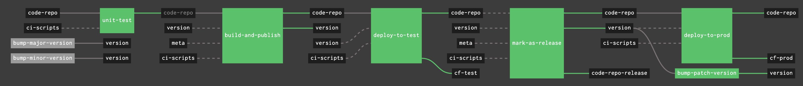
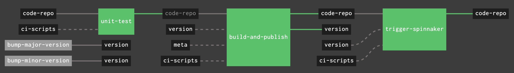
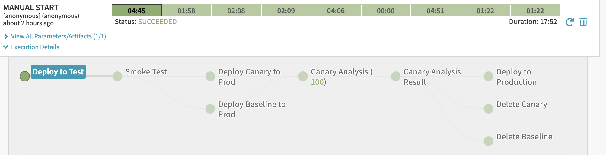

# Concourse/Spinnaker Demo Application

This demo application works through a CI/CD pipeline exclusively with Concourse.  An then
follows up with a CI pipeline with concourse and CD pipeline with Spinnaker.

*CI/CD Pipeline with Concourse Only*



*CI/CD Pipeline with Concourse and Spinnaker*





## Generate load on the production Spinnaker deployed service
```bash
kubectl -n default run injector --image=alpine:3.10 --generator=run-pod/v1  -- \
    /bin/sh -c "apk add --no-cache curl; \
    while true; do curl -sS --max-time 3 \
    https://pickup-prediction.cfapps.io/predict; done"
```

## Deploy to Artifactory Locally    

```bash
export REPO_CONTEXT_URL=$REPO_CONTEXT_URL
export M2_SETTINGS_REPO_USERNAME=$M2_SETTINGS_REPO_USERNAME
export M2_SETTINGS_REPO_PASSWORD=$M2_SETTINGS_REPO_PASSWORD

REPO_CONTEXT_URL=$REPO_CONTEXT_URL \
    M2_SETTINGS_REPO_USERNAME=$M2_SETTINGS_REPO_USERNAME \
    M2_SETTINGS_REPO_PASSWORD=$M2_SETTINGS_REPO_PASSWORD \
    BUILD_ID=123 \
    BUILD_URI=local-machine \
    mvn clean deploy
```

## Setup Concourse Pipeline

```bash
fly -t lab login -k

fly -t lab set-pipeline  -p pickup-prediction-service-spinnaker \
    --config ci/pipeline-spinnaker.yml \
    --load-vars-from ci/.secrets.yml \
    --non-interactive
 
fly -t lab unpause-pipeline -p pickup-prediction-service-spinnaker

fly -t lab set-pipeline  -p pickup-prediction-service-concourse \
    --config ci/pipeline.yml \
    --load-vars-from ci/.secrets.yml \
    --non-interactive

fly -t lab unpause-pipeline -p pickup-prediction-service-concourse

```

## Run e2e tests

```bash
APPLICATION_URL="https://pickup-prediction.cfapps.io" mvn clean verify -Pe2e
```

## Cleanup Smoke Test Jobs

```bash
kubectl delete job -l spinnaker-job=e2e-test
```

## Deploy Spinnaker Application, Canary Config and Pipeline    

>Note: spin cli does not have methods to work on canary configs, so we have to use curl

```bash
spin application save \
  --application-name pickuppredictionservice \
  --cloud-providers cloudfoundry,kubernetes \
  --file ci/spinnaker/pickup-prediction-service/application.json \
  --owner-email dpfeffer@pivotal.io \
  --gate-endpoint https://api.spinnaker.ingress.kingslanding.pks.lab.winterfell.live \
  --insecure

curl -X POST 
  https://api.spinnaker.ingress.kingslanding.pks.lab.winterfell.live/v2/canaryConfig \
  --header 'Content-Type: application/json' \
  --data @ci/spinnaker/pickup-prediction-service/canary-config/keyenta-test.json \
  --insecure 

spin pipeline save \
  --file ci/spinnaker/pickup-prediction-service/pipeline/delivery.json \
  --gate-endpoint https://api.spinnaker.ingress.kingslanding.pks.lab.winterfell.live \
  --insecure
```

## Credit where credit is do

This sample app is inspired and kickstarted from my co-workers at Pivotal, Amith Nambiar and Pas Apicella.
They had a great [presentation at CF Summit 2019](https://www.youtube.com/watch?v=9C8m7n_sG38&list=PLhuMOCWn4P9h-9tcBVRFCaQ7rmdof66pe&index=94).
